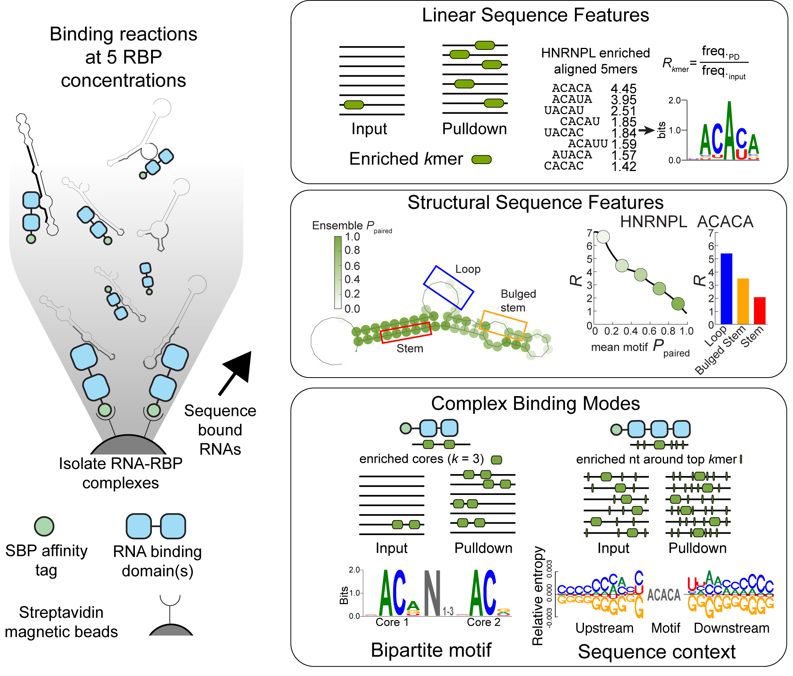

***
### The output directories & files of an RBNS_pipeline run are (assuming you ran the pipeline on the RBFOX3 test_data, which contains the 20 nM and 1300 nM pulldown libraries as well as the input library):

# split_reads/
- RBFOX3_barcode_log.txt contains the number of reads assigned to each barcode, as well as the observed insert lengths if the 'start_of_adapter_seq' argument was specified in the .settings file. It also includes a summary of the 'bad' barcodes (i.e., those that did not match the ones specified).
- 'RBFOX3_input.reads', 'RBFOX3_20.reads', and 'RBFOX3_1300.reads' contain just the random portion of each read; RBFOX3_1300.fastq.gz, etc. contain the 4 lines for each read that were in the original FASTQ file.
- 'RBFOX3_input.lib_complexity', etc. contain the library complexity of each library (how many sequences were unique, how many showed up 2x, 3x, etc. in the library).
- 'RBFOX3_1300.wrong_insert_len.reads': if 'start_of_adapter_seq' was specified, these files contain reads with the library barcode but with an incorrect insert length (indel in the read; these reads were not used in any subsequent calculations).

# tables/
- Contains a number of sub-directories with different types of tables:
### counts_and_freqs/
- kmer counts & frequencies in each library
### enrichments/
- A table like 'RBFOX3_enrichment_R.6mers.txt' contains the 6mer enrichments. Additional files also contain the Z-score for each kmer; mark with an asterisk kmers that are reverse complementary to the adapters (RBFOX3_enrichment_R.6mers.mark_adapters.txt); and contain only the subset of kmers that are enriched at a Z-score of 1, 2, or 3 (e.g., RBFOX3_enrichment_R.6mers.sig_R_Zscore1.0_in_20.txt, where 20 is the most enriched concentration used for the Z-score cutoff).
### lib_frac/
- If 'stream_count' was requested, the SKA values in descending order (RBFOX3_est_binding_frac.5mers.txt), as well as SKA values in order of descending R value (RBFOX3_est_binding_frac.5mers.ordered_by_enrichment.txt).
### by_position/
- if 'by_position_count' was requested, a file for each kmer (e.g., by_position/6/RBFOX3_TTGTTT.by_position.txt) contains the relative frequency of that kmer in each particular library, relative to it being distributed equally 5' -> 3' throughout the read (e.g., for a 6mer within a random 20mer, which has 15 possible starting locations in the 20mer, its relative frequency that starting location * 15).
### B_factors
- A table that reports the "B factor" (model in which the RBP binds to that kmer with a K_d B times lower than all other nonspecific kmers; see Eqn. 18 of the Supp. info of Lambert et al. 2014 for more information on B factors).
### adapters/
- Contains the enrichment values for all kmers that are a reverse complement of some portion of the adapter sequence. If you suspect that some RNAs may have formed double-stranded sequence from folding back of the adapters with random sequence, you may want to examine the frequency/enrichment of these kmers and see if they are unevenly distributed along the random region.

# unique/
- This directory contains the same files as the 'split_reads' directory, except that each read library contains only 1 occurrence of each read (i.e., even if a read occurs at more than 1x in 'RBFOX3_input.lib_complexity', it only occurs once in these split read files). Our own analysis shows enrichments, etc. from these files are largely the same as those on the original split_read files, but if you have very low library complexity, you may want to use these read files instead.

# logos/
- If 'ks_to_test_logos' & 'z_scores_for_logos' were requested, there will be a separate sub-directory for each k / Z-score threshold pair of parameters. For example (for k = 5, Z-score = 3):
### k_5_to_4_Zscoretokeep_3.0/: 
- in_both/ contains the composite logos incorporating kmers that were sig. enriched in both halves of the logo pipeline run. A file like 'RBFOX3_5mer_seqlogos.pdf' contains the sequence logo(s) with a barplot in proportion to their summed kmers' enrichments if there is more than one logo, with other files in the directory containing only the sequence & probability logos; RBFOX3_5mer_logo0.PWM, etc. contain the PWMs derived from the weighted aligned kmers that were used to make each logo.
- A file like RBFOX3_5mers_for_logo.in_both.pruned.txt contains the kmers that were aligned into each logo along with their stepwise R-1 weights (the unpruned version contains the full kmers; the .pruned version does not include any leading or lagging positions that were removed as they contained >75% unaligned weight.

# counts/
- Contains pickled dictionaries of various count types:
#### naive/
- Contains the raw counts, which are converted into frequencies for enrichments.

#### by_position/
- If 'nt_freqs_by_position' and/or 'by_position_count' was requested in the settings file, this contains the nt frequences and/or kmer counts at each position within the read.

#### stream/
- Contains the streaming kmer assignment (SKA) counts if 'stream_count' was requested.

# frequency_Ds/ and enrichment_Ds/

- Pickled dictionaries of kmer frequencies in all libraries and enrichments in pulldown libraries, respectively.

# errors/

- If all goes well, there will be nothing in here, but if you launch jobs onto a PBS/Torque queue and something goes wrong, you may want to investigate here.

